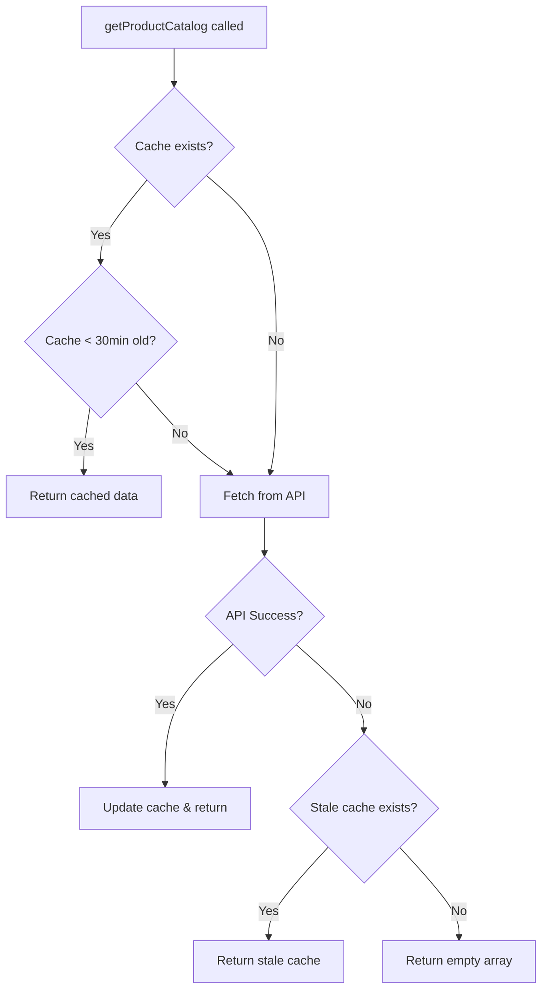

# Barcode Service Architecture

## Critical Design Decision: Use Centralized API Client

### Problem We Solved
Previously, `barcodeService.ts` used raw `fetch()` with manual token handling:
```typescript
// ❌ OLD WAY - FRAGILE
const token = localStorage.getItem('auth_token');
const response = await fetch('/api/products?limit=1000', { 
  headers: { Authorization: `Bearer ${token}` }
});
```

**Issues:**
- Manually reading from localStorage
- No automatic token refresh
- No centralized error handling
- Breaks if auth strategy changes
- 401 errors if token not ready

### Solution: Use Centralized `apiClient`

```typescript
// ✅ NEW WAY - ROBUST
import apiClient from '../utils/api';

const response = await apiClient.get('/products', {
  params: { limit: 1000 }
});
```

**Benefits:**
1. **Automatic Token Injection**: Request interceptor adds token automatically
2. **Centralized Auth Logic**: All API calls follow same pattern
3. **Error Handling**: 401 triggers automatic logout/redirect
4. **Future-Proof**: Auth changes only need updates in `api.ts`
5. **Type Safety**: TypeScript types for responses

## How Authentication Works

### Token Storage (useAuth.ts)
```typescript
localStorage.setItem('auth_token', token);
localStorage.setItem('user', JSON.stringify(userData));
```

### Token Injection (api.ts - Request Interceptor)
```typescript
apiClient.interceptors.request.use((config) => {
  const token = localStorage.getItem('auth_token');
  if (token && config.headers) {
    config.headers.Authorization = `Bearer ${token}`;
  }
  return config;
});
```

### Error Handling (api.ts - Response Interceptor)
```typescript
apiClient.interceptors.response.use(
  (response) => response,
  (error) => {
    if (error.response?.status === 401) {
      // Auto-logout and redirect to login
      localStorage.removeItem('auth_token');
      localStorage.removeItem('user');
      window.location.href = '/login';
    }
    return Promise.reject(error);
  }
);
```

## Barcode Service Flow

### 1. Pre-warm Cache (on POS load)
```typescript
// POSPage.tsx - Only when user is authenticated
useEffect(() => {
  if (activeUser?.token) {
    setTimeout(() => {
      preWarmProductCache(); // Uses apiClient internally
    }, 100); // Small delay ensures token is ready
  }
}, [activeUser?.token]);
```

### 2. Cache Strategy


### 3. Barcode Scanning
```typescript
handleBarcodeScanned(barcode) {
  const products = await getProductCatalog(); // Cached, no API call
  const match = findProductByBarcode(barcode, products);
  if (match) {
    addToCart(match.product, match.uom);
  }
}
```

## Rules to Never Break

### ✅ DO:
- **Always use `apiClient`** for API calls (not `fetch()`)
- **Import from `../utils/api`** for consistency
- **Trust the interceptors** to handle auth
- **Cache aggressively** for offline support
- **Check `activeUser?.token`** before pre-warming

### ❌ DON'T:
- **Never use raw `fetch()`** for authenticated endpoints
- **Never read `auth_token` manually** from localStorage
- **Never build Authorization headers** yourself
- **Never bypass the centralized client**
- **Never call pre-warm** before user is authenticated

## Testing Pre-warming

### Test Scenario 1: Login → Load POS
```
1. User logs in
2. Navigate to /pos
3. activeUser.token becomes available
4. 100ms delay passes
5. preWarmProductCache() called
6. apiClient.get('/products') with token
7. Cache populated ✅
```

### Test Scenario 2: Logout → Login → Load POS
```
1. User logs out
2. activeUser becomes null
3. Pre-warm hook doesn't fire ✅
4. User logs in
5. auth-changed event fires
6. storageVersion increments
7. activeUser recomputes with new token
8. Pre-warm hook fires with valid token ✅
```

### Test Scenario 3: Page Refresh
```
1. Page refreshes
2. activeUser reads from localStorage
3. Token exists → pre-warm fires
4. Token missing → pre-warm doesn't fire ✅
```

## Debugging Guide

### Issue: 401 Unauthorized on pre-warm
**Check:**
```typescript
// 1. Is token in localStorage?
console.log('Token:', localStorage.getItem('auth_token'));

// 2. Is activeUser computed correctly?
console.log('Active User:', activeUser);

// 3. Is pre-warm being called?
console.log('Pre-warming...'); // Add in useEffect

// 4. Is apiClient interceptor working?
// Check Network tab → Request Headers → Authorization
```

### Issue: Stale cache being used
**Fix:**
```typescript
// Clear cache manually
localStorage.removeItem('product_catalog_cache');
// Or reduce cache TTL (currently 30 minutes)
```

### Issue: Pre-warm called before token ready
**Fix:**
```typescript
// Increase delay (currently 100ms)
setTimeout(() => preWarmProductCache(), 500);
```

## Migration Checklist

If you need to add another service that fetches data:

- [ ] Import `apiClient` from `../utils/api`
- [ ] Use `apiClient.get()` / `.post()` / etc. (not `fetch()`)
- [ ] Don't manually add Authorization headers
- [ ] Add caching strategy if needed
- [ ] Only call when user is authenticated
- [ ] Handle 401 errors gracefully (or let interceptor handle it)

## Related Files

- `samplepos.client/src/utils/api.ts` - Centralized API client with interceptors
- `samplepos.client/src/hooks/useAuth.ts` - Auth state management
- `samplepos.client/src/services/barcodeService.ts` - This service
- `samplepos.client/src/pages/pos/POSPage.tsx` - Pre-warm trigger

## Last Updated
November 23, 2025 - Migrated from raw `fetch()` to `apiClient`
