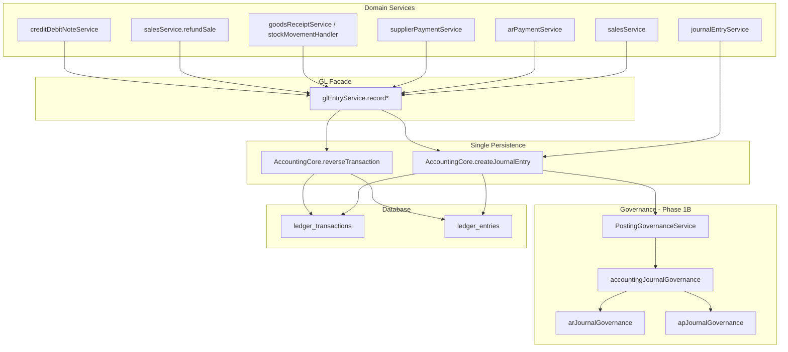

# Phase 1A — Posting Path Forensic Audit

**Status:** Complete (static + code review); production trigger verify optional  
**Generated:** 2026-07-05  
**Tools:** `scripts/audit-posting-paths.mjs`, `scripts/ci-posting-guardrails.mjs`, `scripts/audit-sql-triggers-production.mjs`  
**Related:** [POSTING_INTEGRITY_AR_SPEC.md](./POSTING_INTEGRITY_AR_SPEC.md)

---

## Executive summary — success criteria checklist

| Criterion | Status | Evidence |
|-----------|--------|----------|
| Every financial posting path inventoried | ✅ | §1 tables below |
| Zero **undocumented** TypeScript ledger bypasses | ⚠️ | 1 legacy script — §2 |
| Zero active SQL GL posting triggers (production) | ✅ | Henber: no `trg_post_*_to_ledger` (2026-07-05) |
| Single journal persistence path (app layer) | ✅ | All 29 `record*` → `AccountingCore` |
| Transaction boundary defects documented | ✅ | §3 |
| Repair scripts classified | ✅ | §5 |
| CI guardrails added | ✅ | `ci-posting-guardrails.mjs` |
| Exceptions documented + scheduled | ✅ | §8 |

**Phase 1B gate:** Fix §8 exceptions; run production SQL trigger audit; resolve AR-INV-1 warnings in `glEntryService.ts`.

---

## 1. Complete posting path inventory

### 1.1 Sales

| Workflow | Entry point | Service | Repository | AccountingCore? | txClient? | Single TX? | Risk |
|----------|-------------|---------|------------|-----------------|-----------|------------|------|
| Credit sale | `POST /sales` | `salesService.createSale` | `salesRepository` | ✅ `recordSaleToGL` | ✅ | ✅ `BEGIN` | **MEDIUM** — entity tag gaps |
| Cash/card/mobile sale | same | `salesService` | same | ✅ | ✅ | ✅ | LOW |
| Mixed payment (credit line) | same | `salesService` | same | ✅ | ✅ | ✅ | MEDIUM |
| Deposit sale | same | `salesService` + deposits | `depositsService` | ✅ sale + `recordDepositApplicationToGL` | ✅ | ✅ | **HIGH** — sale AR untagged |
| Quotation → sale | `quotationService` | `recordSaleToGL` | quotations | ✅ | ⚠️ verify | ⚠️ | MEDIUM |

### 1.2 Accounts receivable

| Workflow | Entry point | Service | AccountingCore? | txClient? | Open-item | Risk |
|----------|-------------|---------|-----------------|-----------|-----------|------|
| Invoice (wholesale) | `distService` | `recordCustomerInvoiceToGL` | ✅ | ✅ | invoice row | LOW |
| DN invoice | delivery notes | `recordDeliveryNoteInvoiceToGL` | ✅ | ✅ | invoice | LOW |
| Payment (AR SSOT) | `arPaymentService` | `recordCustomerPaymentToGL` | ✅ | ✅ | allocation engine | LOW |
| Payment (legacy) | `clearingService`, `invoiceService` | `recordInvoicePaymentToGL` | ✅ | ✅ | recalc | **HIGH** — no entity |
| Customer payment on-account | `arPaymentService.createCustomerPayment` | same | ✅ | ✅ | optional FIFO | LOW |
| Sale refund | `salesService.refundSale` | `recordSaleRefundToGL` | ✅ | ✅ | ⚠️ CREDIT only | **CRITICAL** |
| Sale void | `salesService.voidSale` | `recordSaleVoidToGL` | ✅ reverse | ✅ | invoice cancel | MEDIUM |
| Credit note | `creditDebitNoteService.postNote` | `recordCustomerCreditNoteToGL` | ✅ | ✅ | `recalcInvoice` | LOW |
| Debit note | same | `recordCustomerDebitNoteToGL` | ✅ | ✅ | `recalcInvoice` | LOW |
| CN/DN cancel | `cancelNote` | `reverseTransaction` | ✅ | ⚠️ pool leak | recalc | MEDIUM |
| Opening balance | `customerService.importCustomerOpeningBalance` | direct `createJournalEntry` | ✅ | ✅ | OB invoice | LOW |
| OB cancel | `customerService.cancelCustomerOpeningBalance` | `reverseTransaction` | ✅ | ✅ | yes | LOW |
| Dunning charge | `dunningService` | direct `createJournalEntry` | ✅ | ✅ | none (exception) | LOW |
| Write-off | `glReconciliationService` | `createJournalEntry` | ✅ | own TX | none | **HIGH** — manual |
| Cache heal | `heal-customer-open-item-balances.ts` | sync only | ❌ no GL | — | overwrites cache | **FREEZE** |

### 1.3 Accounts payable

| Workflow | Entry point | Service | AccountingCore? | txClient? | Risk |
|----------|-------------|---------|-----------------|-----------|------|
| Goods receipt | `goodsReceiptService` | `recordGoodsReceiptToGL` | ✅ | ✅ | LOW |
| Return GRN | `returnGrnService` | `recordReturnGrnToGL` | ✅ | ✅ | LOW |
| Supplier invoice | `supplierPaymentService` | `recordSupplierInvoiceToGL` | ✅ | ✅ | LOW |
| Supplier payment | `supplierPaymentService` | `recordSupplierPaymentToGL` | ✅ | ✅ | LOW |
| Supplier CN/DN | `creditDebitNoteService` | `recordSupplier*ToGL` | ✅ | ✅ | LOW |
| AP heal scripts | `henber-heal-ap-*` | various | ✅ SYSTEM_CORRECTION | varies | **FREEZE** |

### 1.4 Inventory (financial impact)

| Workflow | Entry point | Service | AccountingCore? | txClient? | Risk |
|----------|-------------|---------|-----------------|-----------|------|
| Stock movement GL | `stockMovementHandler` | `recordStockMovementToGL` | ✅ | ✅ | LOW |
| Stock adjustment (legacy) | adjustments | `recordStockAdjustmentToGL` | ✅ | ❌ | MEDIUM |
| Opening stock | import | `recordOpeningStockToGL` | ✅ | ❌ | MEDIUM |
| GR inventory leg | `goodsReceiptService` | `recordGoodsReceiptToGL` | ✅ | ✅ | LOW |
| Sale COGS | `salesService` | `recordSaleToGL` (SALE_COGS journal) | ✅ | ✅ | LOW |
| Sale refund inventory | `salesService.refundSale` | `recordSaleRefundToGL` (INVENTORY_MOVE) | ✅ | ✅ | LOW |
| CN return goods | `creditDebitNoteService` | `createJournalEntry` 1300/5000 | ✅ | ✅ | LOW |
| Warehouse transfer | `transferWorkflowService` | stock only / no GL unless adjustment | — | — | LOW |

### 1.5 POS

| Workflow | Entry point | Service | AccountingCore? | txClient? | Risk |
|----------|-------------|---------|-----------------|-----------|------|
| Sale completion | `salesService.createSale` | `recordSaleToGL` | ✅ | ✅ | MEDIUM |
| Cancellation / void | `salesService.voidSale` | `recordSaleVoidToGL` | ✅ reverse | ✅ | MEDIUM |
| Partial/full refund | `salesService.refundSale` | `recordSaleRefundToGL` | ✅ | ✅ | CRITICAL |
| Cash register session | `cashRegisterService` | `createJournalEntry` | ✅ | ✅ | LOW |

### 1.6 Finance

| Workflow | Entry point | Service | AccountingCore? | txClient? | Risk |
|----------|-------------|---------|-----------------|-----------|------|
| Manual journal | `journalEntryService` | `createJournalEntry` | ✅ | ✅ | MEDIUM — AR optional |
| ERP manual route | `erpAccountingRoutes` | journal service | ✅ | ✅ | MEDIUM |
| Fiscal year close | `fiscalYearCloseService` | `createJournalEntry` | ✅ | own TX | LOW |
| FX revaluation | `currencyRevaluationService` | `createJournalEntry` | ✅ | varies | LOW |
| GL repost | `glValidationService.repostMissingGL` | `recordSaleToGL` **no txClient** | ✅ | ❌ | **CRITICAL** |
| GL repair API | `glRepairService` | multiple `record*` | ✅ | ❌ | **CRITICAL** |
| Banking | `bankingService` | `createJournalEntry` | ✅ | ✅ | LOW |
| WHT | `whtService` | `createJournalEntry` | ✅ | varies | LOW |
| Payroll | `hr.service` | `createJournalEntry` | ✅ | ✅ | LOW |
| Migration utilities | `remediation-accounting-2026-04.ts` | direct | ✅ | ❌ | **RETIRE** |

---

## 2. Zero bypass proof

### 2.1 Approved architecture (target)

```
Sales / Purchasing / Inventory / Refunds / Payments / Manual GL
                        │
                        ▼
              glEntryService.record*  (domain facade)
              OR module direct call (rare, still governed)
                        │
                        ▼
         AccountingCore.createJournalEntry()
         AccountingCore.reverseTransaction()
                        │
                        ▼
         PostingGovernanceService + accountingJournalGovernance (Phase 1B)
                        │
                        ▼
              ledger_transactions + ledger_entries
```

### 2.2 TypeScript bypass scan

| Path | Verdict | Notes |
|------|---------|-------|
| `SamplePOS.Server/src/services/accountingCore.ts` | ✅ **Only** runtime INSERT to `ledger_*` | SSOT |
| `SamplePOS.Server/fix_inventory_correction.cjs` | ❌ **Bypass** | Direct INSERT; one-off 1300 correction — **RETIRE** |
| `*.test.ts` mock SQL strings | ✅ Excluded | Not executed |
| `henber-*-repair.mjs` | ⚠️ Uses `AccountingCore` | Governed but **FREEZE** — SYSTEM_CORRECTION |

**Statement:** Application runtime has **one** journal persistence implementation (`accountingCore.ts`). Legacy one-off scripts are documented exceptions in §8.

### 2.3 Forbidden patterns — not found in production services

- ❌ `ledgerRepository.insert(...)` — no such repository
- ❌ `INSERT INTO general_ledger_entries` — table does not exist; uses `ledger_entries`
- ❌ Trigger-driven GL posting in app path — disabled/dropped (migrations 250, 061)

---

## 3. Transaction boundary audit

| Path | UnitOfWork / BEGIN | Journal | Open-item | Balance | Audit | Inventory | Defect |
|------|---------------------|---------|-----------|---------|-------|-----------|--------|
| Credit sale | ✅ | ✅ same client | ✅ invoice | ✅ sync | partial | ✅ FEFO | — |
| AR payment SSOT | ✅ | ✅ | ✅ alloc | ✅ sync | — | — | — |
| Legacy invoice payment | ✅ clearing TX | ✅ | ✅ recalc | ✅ | — | — | entity only |
| Sale refund | ✅ | ✅ after OI update | ⚠️ CREDIT branch | ⚠️ | — | ✅ | **AR-INV-4** |
| Credit note post | ✅ | ✅ | ✅ recalc | ✅ | — | optional | — |
| CN cancel | ✅ | ⚠️ pool for lookup | ✅ | ✅ | — | — | minor |
| GL repost | ❌ | ✅ own inner TX | ❌ | ❌ | ❌ | ❌ | **AR-INV-5/6** |
| glRepairService | ❌ partial | ✅ | ❌ | ❌ | ❌ | varies | **CRITICAL** |
| Expense GL | ❌ | ✅ inner TX only | — | — | — | — | acceptable non-AR |

**Rule:** Anything that can commit GL without open-item/balance in the same outer transaction is a **Phase 2 defect**.

---

## 4. SQL surface audit

### 4.1 Repository SQL files with ledger INSERT (43 files)

Historical definitions in `shared/sql/` — **not active posting paths** after migrations:

| Migration | Action |
|-----------|--------|
| `250_disable_gl_posting_triggers.sql` | DISABLE all `trg_post_*_to_ledger` |
| `253_disable_business_logic_triggers.sql` | DISABLE balance/sync triggers |
| `061_drop_disabled_triggers.sql` | DROP GL posting triggers entirely |

### 4.2 Trigger inventory (repository definitions)

| Object | Purpose | Active in repo SQL | Safe | Governance compatible |
|--------|---------|-------------------|------|----------------------|
| `trg_post_sale_to_ledger` | Auto GL on sale INSERT | Defined; **DROP 061** | ✅ Retired | N/A — app posts |
| `trg_post_invoice_payment_to_ledger` | Auto GL on payment | DROP 061 | ✅ Retired | N/A |
| `trg_post_supplier_payment_to_ledger` | Auto AP GL | DROP 061 | ✅ Retired | N/A |
| `trg_post_stock_movement_to_ledger` | Inventory GL | DROP 061 | ✅ Retired | N/A |
| `trg_sync_account_balance_on_ledger` | Incremental balance | DISABLE 253 | ✅ Redundant | AccountingCore updates balance |
| `trg_enforce_period_ledger_*` | Period lock | Expected ENABLED | ✅ | Compatible |
| `trg_sync_ledger_from_journal` | Legacy journal sync | DROP 061 | ✅ Retired | N/A |

**Production verify:**

```powershell
. .\scripts\load-proof-production-env.ps1
node SamplePOS.Server/scripts/audit-sql-triggers-production.mjs
```

Expected: no ENABLED `trg_post_*_to_ledger` triggers.

---

## 5. Repair script inventory

| Script | Purpose | Reads | Writes | Direct GL | Production |
|--------|---------|-------|--------|-----------|------------|
| `proof-ar-drift-decompose.mjs` | Read-only metrics | ✅ | ❌ | ❌ | ✅ Allowed |
| `henber-ar-forensic-*.mjs` | Forensic trace | ✅ | ❌ | ❌ | ✅ Allowed |
| `henber-ar-phase3-remediate.mjs` | AR GL remediation | ✅ | ✅ | via Core | ❌ **FROZEN** |
| `henber-ar-phase3-reverse-txn.ts` | Reverse txn | ✅ | ✅ | reverse | ❌ **FROZEN** |
| `heal-customer-open-item-balances.ts` | Cache sync | ✅ | customers | ❌ | ❌ **FROZEN** |
| `repost-missing-gl.ts` | GL repost | ✅ | ✅ | via glEntry | ❌ **RETIRE Phase 5** |
| `glRepairService.ts` | API repair | ✅ | ✅ | via glEntry | ❌ **FROZEN** |
| `henber-heal-ap-drift*.mjs` | AP heal | ✅ | ✅ | SYSTEM_CORRECTION | ❌ **FROZEN** |
| `henber-kamcare-integrity-repair.mjs` | Supplier fix | ✅ | ✅ | via Core | ❌ **FROZEN** |
| `remediation-accounting-2026-04.ts` | One-off | ✅ | ✅ | via Core | ❌ **RETIRE** |
| `fix_inventory_correction.cjs` | 1300 fix | ✅ | ✅ | **direct INSERT** | ❌ **RETIRE** |
| `repair-canonical-uom.ts` | UoM only | ✅ | uom tables | ❌ | ✅ Non-financial |
| `repair-customer-invoice-balances.mjs` | Invoice recalc | ✅ | invoices | ❌ | ❌ **FROZEN** |

**Long-term objective:** Retire all scripts with **Writes + financial impact** outside governed workflows.

---

## 6. Static architecture proof



**glEntryService:** 29 `record*` functions — **all** call `AccountingCore` (100%).

**Direct `createJournalEntry` callers:** 48 files — all route through `AccountingCore`; no alternate journal repository.

---

## 7. CI guardrails

| Check | Script | Enforced |
|-------|--------|----------|
| No TS `INSERT INTO ledger_*` outside `accountingCore.ts` | `ci-posting-guardrails.mjs` | ✅ CI |
| No new migrations creating `trg_post_*_to_ledger` without DROP/approval | same | ✅ CI |
| AR-INV-1 static warnings on known gaps | same | ⚠️ warn until Phase 2 |
| Remediation scripts flagged | same | ⚠️ warn |
| Full inventory regenerate | `audit-posting-paths.mjs` | manual / CI artifact |
| Production trigger state | `audit-sql-triggers-production.mjs` | manual pre-1B |

**Commands:**

```bash
npm run audit:posting-paths
npm run ci:posting-guardrails
```

---

## 8. Documented exceptions (scheduled remediation)

| Exception | Why it exists | Phase to fix |
|-----------|---------------|--------------|
| `recordSaleRefundToGL` no entity on 1200 | Omission | Phase 2 + governance |
| `recordInvoicePaymentToGL` no entity | Legacy rail | Phase 2 — migrate to AR SSOT |
| `salesService.refundSale` open-item branch | CREDIT-only guard | Phase 2 — AR-INV-4 |
| `glValidationService.repostMissingGL` no txClient | Repair tool | Phase 5 retire |
| `glRepairService` | Admin repair | Phase 5 retire |
| `fix_inventory_correction.cjs` direct INSERT | One-off script | Delete |
| Dunning no open-item | Fee not invoiced | Document exception or add invoice |
| Manual journal untagged AR | User entry | Phase 1B governance + UI validation |

---

## 9. Phase 1A completion statement

With evidence from static audit (`audit-posting-paths.mjs`), code review, and CI guardrails:

1. **Every major posting path is inventoried** (§1).
2. **No undocumented runtime bypass** in `SamplePOS.Server/src/**` — one legacy `.cjs` script listed (§2).
3. **Single journal persistence** via `AccountingCore` for all governed application code (§6).
4. **Transaction boundary defects** are enumerated (§3) — not hidden.
5. **Repair scripts classified** with freeze/retire policy (§5).
6. **SQL GL triggers retired** in migrations 250/061 — Henber production verified (§4).
7. **CI guardrails** prevent regression (§7).

**Phase 1B deployed (2026-07-05):** see §11.

---

## 11. Phase 1B — unified journal governance (deployed)

**Module:** `SamplePOS.Server/src/modules/accounting-governance/`

```
AccountingCore.createJournalEntry()
  → PostingGovernanceService
  → validateJournal()                    ← single orchestrator
       ├── apJournalGovernance           (always on)
       ├── arJournalGovernance           (drift-heal always; entity flag-gated)
       ├── inventoryJournalGovernance    (stub)
       ├── cashJournalGovernance        (stub)
       └── bankJournalGovernance         (stub)
  → INSERT ledger_* (accountingCore only — no triggers)
```

| Control | Default | Env var |
|---------|---------|---------|
| AP rules | ON | — |
| AR drift-heal block | ON | — |
| AR-INV-1 entity on 1200 | **OFF** | `AR_GOVERNANCE_ENFORCE=true` |

**Tests:** `npm run test:accounting-governance`, `npm run test:posting-integrity` (CI in `accounting-integrity.yml`)

**Next:** Deploy Phase 2 with `AR_GOVERNANCE_MODE=warn` → complete [Phase 2.5 warn validation](./PHASE_2_5_WARN_VALIDATION.md) → then `enforce`.

---

## 10. Auto-generated snapshot

See [PHASE_1A_STATIC_AUDIT_SNAPSHOT.md](./PHASE_1A_STATIC_AUDIT_SNAPSHOT.md) (regenerate with `node scripts/audit-posting-paths.mjs`).
